  

  <strong>Self-hosted AI. Security-first. Always innovating.</strong>

---

20+ years in cybersecurity, now running a self-hosted AI fleet on budget Intel Arc
hardware — a memory brain, autonomous agents, local LLMs that actually ship. I
open-source the good parts. Always innovating. Deep South.

### 🧭 About

**Dirty South Alpha** — a one-person AI infrastructure shop with two decades of
cybersecurity behind it. I run a full self-hosted fleet on consumer Intel Arc GPUs:
local model serving, a shared brain that remembers across every tool, autonomous
agents, and a live control dashboard — then open-source the pieces worth sharing.
Security-first, production-minded, always building something new.

### 🔦 Featured

New here? **[Start with intel-arc-llm-stack](https://github.com/dirtysouthalpha/intel-arc-llm-stack)** — run any LLM locally on Intel Arc.

| Repo | What it does | Why you care |
|------|--------------|--------------|
| [intel-arc-llm-stack](https://github.com/dirtysouthalpha/intel-arc-llm-stack) | Run any LLM locally on Intel Arc GPUs | Skip the NVIDIA tax — real local inference on budget hardware |
| [muse-maestro](https://github.com/dirtysouthalpha/muse-maestro) | Guardrails, memory & cost telemetry for Meta Muse Code | Keep coding agents safe, cheap, and observable |
| [sentinel-cli](https://github.com/dirtysouthalpha/sentinel-cli) | Multi-provider AI coding agent with smart model routing | One agent, 9+ providers, cheapest-capable routing |
| [intel-arc-llm-benchmarks](https://github.com/dirtysouthalpha/intel-arc-llm-benchmarks) | Measured Arc B60 inference numbers | Real tok/s and quant recipes, not vendor claims |
| [msptier3toolkit](https://github.com/dirtysouthalpha/msptier3toolkit) | Battle-tested MSP PowerShell | Automation from real helpdesk trenches |

### 🛠️ Working with

`Intel Arc / Battlemage` · `llama.cpp` · `IPEX-LLM` · `Vulkan` · `Python` · `TypeScript` ·
`PowerShell` · `MCP` · `local-first LLMs`

---

### 👤 Creator

**Brandon Goolsby** (he/him) — Senior AI Engineer with a 20+ year cybersecurity background.
Security+ · ISC2 CC · CCNA-level · SonicWall SNSA. I build autonomous AI systems and run a
full self-hosted fleet on budget Intel Arc hardware — then open-source the parts worth sharing.

  

---

  
  
  

⭐ Star the repos that help, and <a href="https://github.com/dirtysouthalpha">follow @dirtysouthalpha</a> — new self-hosted AI tools ship regularly.

Every repo shares one visual identity — the <a href="BRAND.md">AURORA-X neon brand kit</a>.

