<p align="center">
  
</p>

<p align="center">
  <a href="https://dirtysouthalpha.com"></a>
  
  
  <a href="https://www.linkedin.com/in/brandongoolsby-706/"></a>
</p>

---

```
> whoami
```

20 years in the trenches of security. now i run a full self-hosted AI fleet on budget
Intel Arc silicon — local models, autonomous agents, a memory brain. all of it mine,
none of it in the cloud. the useful pieces ship here.

### `// the fleet`

- **Neuralis** — a persistent brain that remembers across every tool & agent. hybrid semantic + graph recall, self-correcting.
- **Sentinel Prime** — autonomous desktop & fleet agents. goals in, work done — guardrails clamped on money & anything outbound.
- **AURORA-X** — one glass pane over the fleet: voice, vision, live status, and a chat that drives real work.
- **Maestro** — guardrails, memory & cost telemetry bolted onto coding agents.
- **Intel Arc stack** — local LLM serving on Arc B60 / Battlemage. budget silicon, real throughput.

### `// featured`

| repo | what it does |
|---|---|
| **[intel-arc-llm-stack](https://github.com/dirtysouthalpha/intel-arc-llm-stack)** | run any LLM locally on Intel Arc. the stack i wish existed. |
| **[muse-maestro](https://github.com/dirtysouthalpha/muse-maestro)** | guardrails, memory & cost telemetry for Meta's Muse Code agent. |
| **[sentinel-code](https://github.com/dirtysouthalpha/sentinel-code)** | multi-provider AI coding agent with smart model routing. |
| **[intel-arc-llm-benchmarks](https://github.com/dirtysouthalpha/intel-arc-llm-benchmarks)** | real, production-tested inference numbers on the Arc B60. |
| **[msp-tier3-toolkit](https://github.com/dirtysouthalpha/msp-tier3-toolkit)** | battle-tested PowerShell from real MSP helpdesk ops. |

### `// live`

see it running — self-hosted AI you can actually touch:
**[dirtysouthalpha.com](https://dirtysouthalpha.com)** → an interactive Neuralis brain, the AURORA-X control dashboard, and a Sentinel Prime autonomous run.

### `// stack`


### `// creator`

**Brandon Goolsby** (he/him) — Senior AI Engineer · 20+ years in cybersecurity.
Security+ · ISC2 CC · CCNA-level · SonicWall SNSA. i build autonomous AI systems and
open-source the parts worth sharing.

<a href="https://www.linkedin.com/in/brandongoolsby-706/"></a>

---

<p align="center"><sub><b>self-hosted AI</b> · <b>security-first</b> · <b>always innovating</b> — every repo shares one identity (<a href="BRAND.md">brand kit</a>)</sub></p>

---
<p align="center"><sub><b>Dirty South Alpha™</b> · © 2026 · <a href="https://dirtysouthalpha.com">dirtysouthalpha.com</a> · self-hosted AI · security-first</sub></p>
